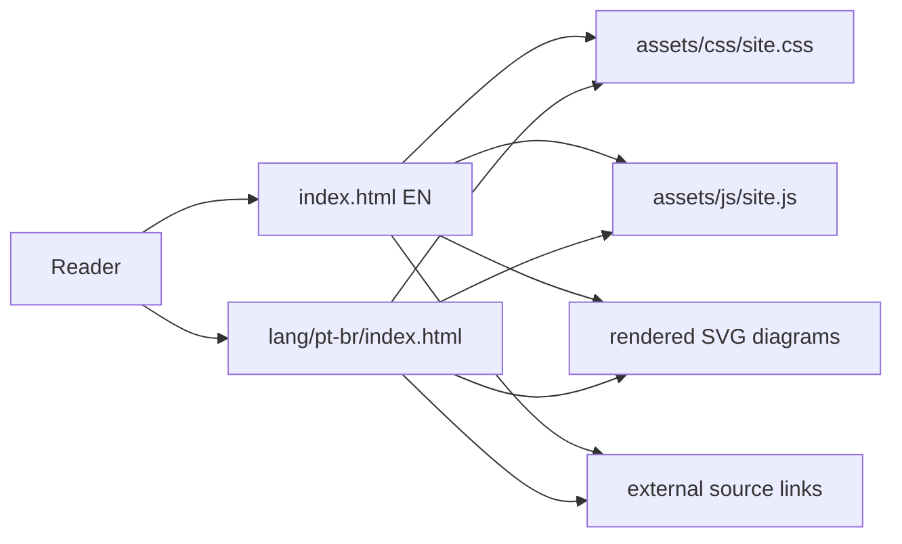

# GEO Basics Guide Design

**Spec:** `.specs/features/geo-basics-guide/spec.md`
**Status:** Approved for implementation from user request

---

## Architecture Overview

The project is a static bilingual guide. The English page lives at the repository root because English is the default language. The Portuguese page reuses the same CSS, JavaScript, diagrams, and structure, with translated content and localized metadata.

## Code Reuse Analysis

### Existing Components to Leverage

| Component | Location | How to Use |
| --- | --- | --- |
| Dublin Core Basics reference | temp clone only | Reuse tone: short slides, simple explanations, code boxes, direct navigation. Do not copy code or assets. |
| Mermaid Studio | installed skill | Create, validate, and render diagrams to SVG. |

### Integration Points

| System | Integration Method |
| --- | --- |
| GitHub Pages | Serve static files from the repository root. |
| Search engines | Canonical, hreflang, robots.txt, sitemap.xml, semantic HTML, structured metadata. |
| AI/search crawlers | Public static content, clear source sections, crawlable snippets, optional crawler control examples. |

---

## Components

### HTML Pages

- **Purpose:** Present localized guide content.
- **Location:** `index.html`, `lang/pt-br/index.html`, `lang/en/index.html`.
- **Interfaces:** Static anchor navigation, language links, copy buttons for snippets.
- **Dependencies:** Shared CSS, shared JS, SVG diagram assets.
- **Reuses:** Same section order and class names across languages.

### Shared Styles

- **Purpose:** Provide responsive guide layout and visual system.
- **Location:** `assets/css/site.css`.
- **Interfaces:** CSS classes for hero, section bands, cards, diagrams, snippets, checklists, source cards.
- **Dependencies:** None.
- **Reuses:** One shared stylesheet for both languages.

### Shared JavaScript

- **Purpose:** Improve navigation, active section state, copy-to-clipboard buttons, and progress bar.
- **Location:** `assets/js/site.js`.
- **Interfaces:** DOM hooks via `data-copy`, `data-section-nav`, and headings.
- **Dependencies:** Browser APIs only.
- **Reuses:** Works on both localized pages.

### Diagram Assets

- **Purpose:** Explain AI answer pipeline, GEO content workflow, and page anatomy.
- **Location:** `assets/diagrams/*.mmd` and `assets/diagrams/*.svg`.
- **Interfaces:** `` tags with alt text and captions.
- **Dependencies:** Mermaid Studio at authoring time only.

### Validation Script

- **Purpose:** Verify static file presence, core links, metadata, anchors, and JS syntax.
- **Location:** `scripts/validate-site.mjs`.
- **Interfaces:** `node scripts/validate-site.mjs [--quick]`.
- **Dependencies:** Node.js standard library.

---

## Content Model

Each localized page follows the same learning path:

1. Opening: title, definition, navigation, language switch.
2. What GEO means: GEO as SEO for answer/citation surfaces.
3. How AI answers work: query fan-out, retrieval, synthesis, citations.
4. GEO pillars: crawlable, understandable, useful, trustworthy, quotable, fresh.
5. Application: pages, articles, metadata, structured data, evidence, media.
6. Code examples: article outline, JSON-LD, robots/crawler controls.
7. Myths: no special Google llms.txt requirement, no guaranteed citations, no keyword stuffing.
8. Measurement: Search Console, Bing AI Performance, manual prompt checks, server logs where appropriate.
9. Sources: official and research references.

---

## Tech Decisions

| Decision | Choice | Rationale |
| --- | --- | --- |
| Stack | Static HTML/CSS/JS | Free GitHub Pages hosting, simple editing, no build lock-in. |
| Language paths | Root EN, `/lang/pt-br/` PT-BR | Matches "English default" and bilingual structure. |
| Diagrams | Pre-rendered SVG | Faster, crawlable, no client-side Mermaid dependency. |
| Metadata | SEO + Dublin Core + JSON-LD | Honors the Dublin Core Basics lineage and helps explicit page meaning. |
| GEO framing | Practical SEO extension | Aligns with Google guidance and avoids unsupported "GEO hacks." |

---

## Error Handling Strategy

| Error Scenario | Handling | User Impact |
| --- | --- | --- |
| JavaScript unavailable | Content and links remain usable. | Only copy buttons/progress enhancements are absent. |
| Diagram SVG unavailable | Alt text and captions describe the diagram. | Reader still gets the concept. |
| Clipboard denied | Button text shows failure state briefly. | User can manually copy snippets. |
| GitHub Pages path base changes | Relative links keep pages working. | Canonical/sitemap may need manual URL update. |
